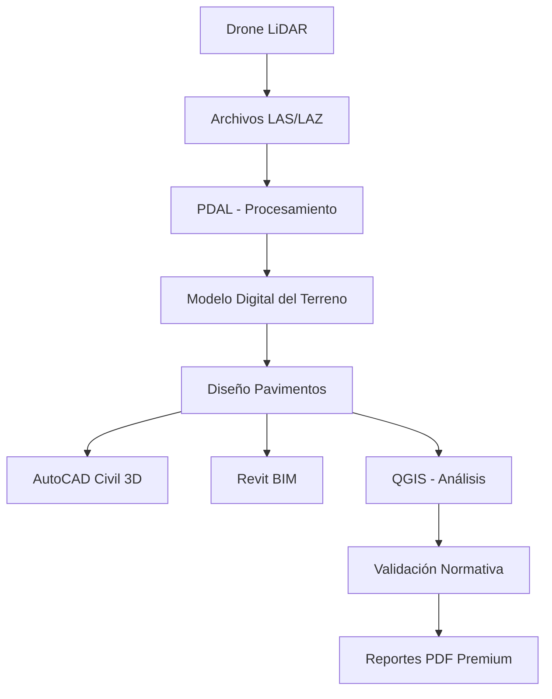

# 🛣️ CONSORCIO DEJ - Sistema de Diseño de Pavimentos Mejorado

## 📋 Descripción

Sistema profesional de diseño de pavimentos rígido y flexible con integración avanzada de:
- **Procesamiento de datos LiDAR** (drones)
- **Diseño automatizado** según normativa peruana
- **Análisis de fatiga PCA**
- **Validación normativa** (DG-2018, MTC, RAS 2020)
- **Exportación a Civil 3D** y BIM
- **Interoperabilidad** con QGIS y Revit

## 🚀 Instalación y Ejecución

### Opción 1: Ejecución Automática (Recomendada)
```bash
# En Windows
EJECUTAR_APP_MEJORADA.bat

# En Linux/Mac
chmod +x EJECUTAR_APP_MEJORADA.sh
./EJECUTAR_APP_MEJORADA.sh
```

### Opción 2: Instalación Manual
```bash
# 1. Instalar dependencias
pip install streamlit numpy matplotlib pandas plotly reportlab

# 2. Ejecutar aplicación
streamlit run APP.py --server.port 8501
```

## 🔐 Acceso al Sistema

**Credenciales de prueba:**
- Usuario: `admin` / Contraseña: `admin123`
- Usuario: `demo` / Contraseña: `demo`

## 🎯 Funcionalidades Principales

### 1. 🚁 Caso Práctico San Miguel
**Ubicación:** San Miguel, Puno (altitud > 3800 msnm)

#### Procesamiento LiDAR (Drones)
- **Entrada:** Archivos LAS/LAZ de drones
- **Procesamiento:** Filtrado de vegetación, generación MDT
- **Salida:** Modelo Digital del Terreno, curvas de nivel, detección de zonas inestables

#### Diseño Automatizado de Pavimentos
**Pavimento Rígido (Norma PCA + DG-2018):**
- Ajuste climático: +30% espesor en Sierra (k < 50 MPa/m)
- Espesor mínimo: 20 cm para vías principales
- Análisis de fatiga PCA
- Cálculo automático de juntas

**Pavimento Flexible (AASHTO 93 modificado):**
- Ajuste por tipo de suelo (volcánico, aluvial)
- Cálculo del número estructural SN
- Distribución de capas según MTC

#### Validación Normativa Peruana
- ✅ Espesor mínimo rígido: 20 cm (DG-2018 Art. 5.4.3)
- ✅ Subbase flexible CBR ≥ 20% (IT.5 - MTC)
- ✅ Pendiente de cuneta ≥ 2% (RAS 2020)

### 2. 🌍 Análisis Avanzado
#### Interoperabilidad
- **AutoCAD Civil 3D:** Exportación automática de capas y elementos
- **QGIS:** Visualización de MDT y curvas de nivel
- **Revit BIM:** Modelado 4D con propiedades de materiales

#### API REST (Futuro)
- Colecta de datos CBR en campo
- Sincronización con base de datos central
- Reportes en tiempo real

## 📊 Requerimientos Técnicos

### Procesamiento de Datos LiDAR
```python
# Ejemplo de uso
resultado = procesar_nube_puntos("datos_dron.las")
print(f"Área: {resultado['Área_ha']} ha")
print(f"Pendiente: {resultado['Pendiente_%']}%")
```

### Diseño de Pavimentos
```python
# Pavimento Rígido
resultado_rigido = diseno_rigido(
    k_subrasante=50,      # MPa/m
    ESALs=100000,         # ejes equivalentes
    resistencia_concreto=28,  # MPa
    clima="sierra"        # o "costa"
)

# Pavimento Flexible
resultado_flexible = diseno_flexible(
    CBR=8,                # %
    ESALs=100000,         # ejes equivalentes
    tipo_suelo="volcánico",  # "volcánico", "aluvial", "otro"
    clima="sierra"        # o "costa"
)
```

### Análisis de Fatiga PCA
```python
analisis = analisis_fatiga_pca(
    ESALs=100000,
    resistencia_concreto=28,
    espesor_cm=25
)
print(f"Estado de losa: {analisis['Estado_losa']}")
```

## 🏗️ Arquitectura del Software



## 📈 Roadmap de Desarrollo

### Fase 1 (0-3 meses)
- ✅ Integración PDAL para datos LAS/LAZ
- ✅ Conexión con QGIS para análisis geotécnico
- ✅ Diseño automatizado según normativa peruana

### Fase 2 (3-6 meses)
- 🔄 API REST para móviles (colecta CBR)
- 🔄 Exportación a BIM (Revit)
- 🔄 Validación automática de normativas

### Fase 3 (6-12 meses)
- 📋 Machine Learning para predicción de vida útil
- 📋 Integración con sistemas de gestión de proyectos
- 📋 Análisis de costos automatizado

## 🧪 Pruebas

Ejecutar pruebas automatizadas:
```bash
python test_app_mejorada.py
```

**Pruebas incluidas:**
- ✅ Procesamiento LiDAR
- ✅ Diseño rígido y flexible
- ✅ Validación normativa
- ✅ Análisis de fatiga
- ✅ Exportación Civil 3D

## 📋 Normativas Implementadas

| Parámetro | Norma Peruana | Requisito |
|-----------|---------------|-----------|
| Espesor mínimo rígido | DG-2018 (Art. 5.4.3) | 20 cm (vías principales) |
| Subbase flexible | IT.5 - MTC | CBR ≥ 20% |
| Pendiente de cunetas | RAS 2020 | 2% mínimo |
| Concreto rígido | IT.EC.030 | NP 350 (MR ≥ 4.5 MPa) |
| Compactación | Art. 410.3 MTC | 95% Proctor Modificado |

## 🔧 Solución de Problemas

### Error: "PDAL no está disponible"
- **Causa:** PDAL requiere compilación C++
- **Solución:** Usar versión demo (funciona sin PDAL real)

### Error: "Matplotlib no disponible"
- **Causa:** Dependencia no instalada
- **Solución:** `pip install matplotlib`

### Error: "Streamlit no encontrado"
- **Causa:** Streamlit no instalado
- **Solución:** `pip install streamlit`

## 📞 Soporte

**CONSORCIO DEJ**
- 📧 Email: soporte@consorciodej.com
- 🌐 Web: https://consorciodej.com
- 📱 Tel: +51 1 123-4567

## 📄 Licencia

© 2024 CONSORCIO DEJ. Todos los derechos reservados.
Desarrollado con Streamlit + Python | Normativas: AASHTO 93, PCA, MEPDG, MTC, RNE

---

**Versión:** 2.0 Mejorada  
**Fecha:** Enero 2024  
**Autor:** IA Assistant - Especialista UNI 